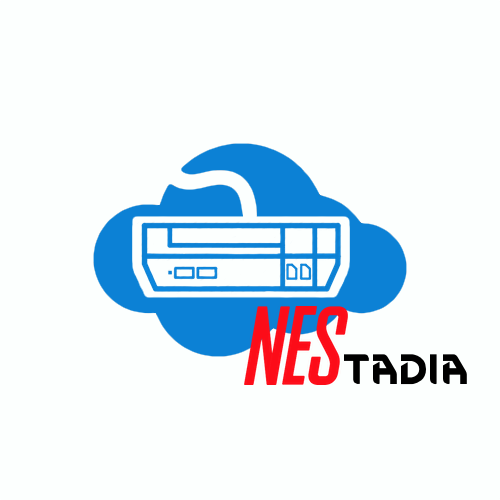

# Nestadia


## What is Nestadia?
Nestadia is a NES emulator that can be ran in server mode so that the emulation itself is done on a server. It was made for NorthSec CTF 2021, although the CTF-related parts were removed from this repo.  
Don't expect your favorite game to work as it is still buggy. It can however serve as a great proof of concept.

## How to build and run.
### Client
First you need to build the client and place it where nestadia-server can find it:
```
cd nestadia-client
npm install
npm run build
cp -r ./dist ../nestadia-server/client_build/
```

### Server
You then need to build and run the server:
```
cd nestadia-server
cargo run --release
```

## License
Code is provided under the MIT or Apache license.
